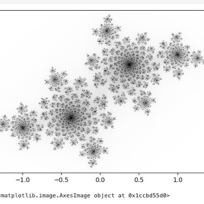
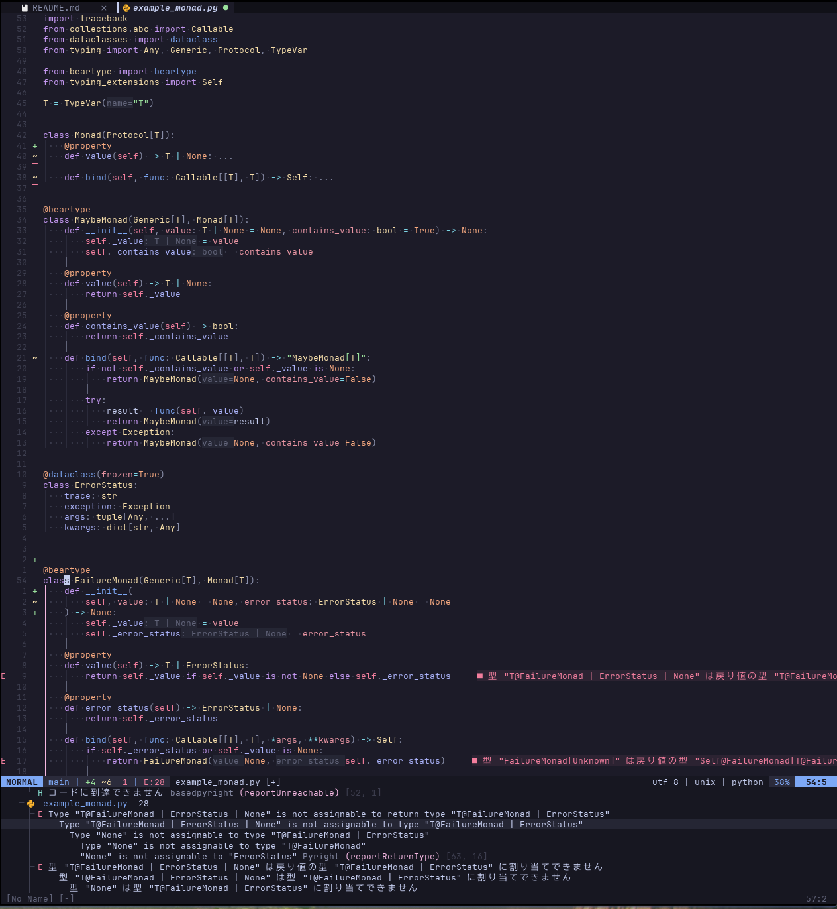
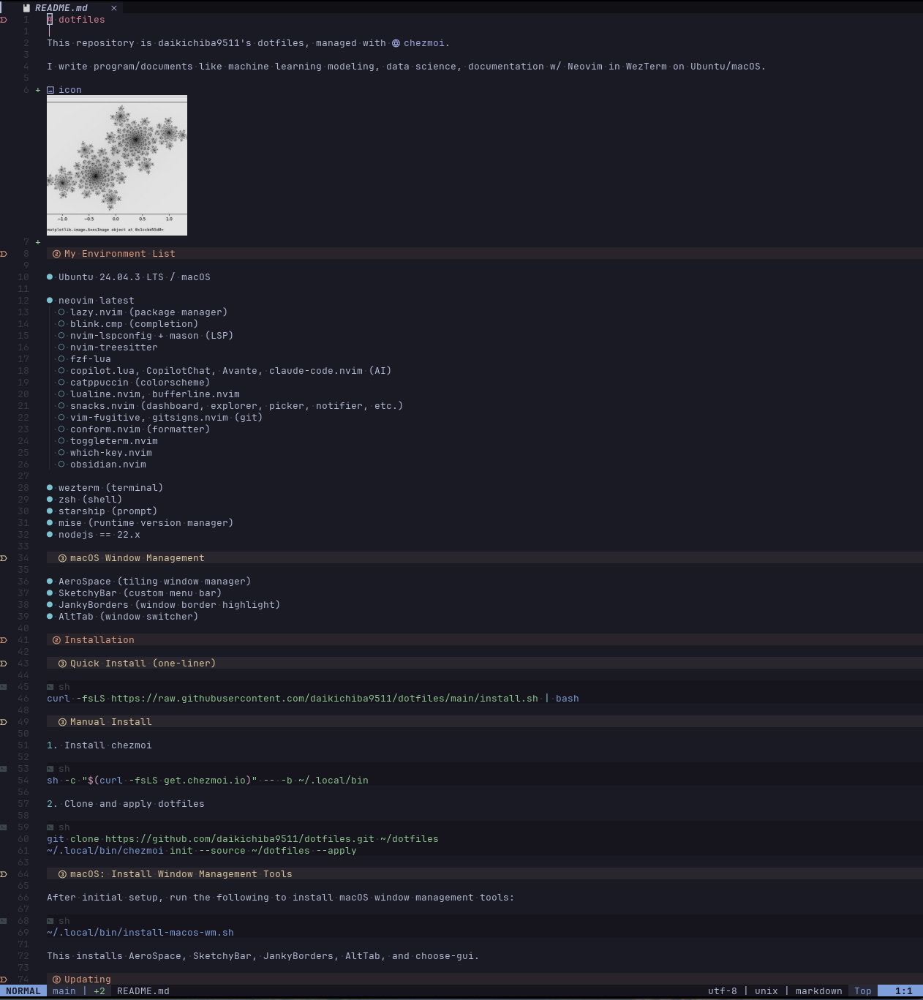

<h1 align="center">
  <br>
  dotfiles
</h1>

<p align="center">
  <strong>Personal development environment managed with <a href="https://www.chezmoi.io/">chezmoi</a></strong>
</p>

<p align="center">
  
  
  
  
</p>

---

## Screenshots

<table>
  <tr>
    <td></td>
    <td></td>
  </tr>
  <tr>
    <td align="center"><strong>Python</strong></td>
    <td align="center"><strong>Markdown</strong></td>
  </tr>
</table>

---

## Quick Start

```sh
curl -fsLS https://raw.githubusercontent.com/daikichiba9511/dotfiles/main/install.sh | bash
```

<details>
<summary><strong>Manual Installation</strong></summary>

```sh
# Install chezmoi
sh -c "$(curl -fsLS get.chezmoi.io)" -- -b ~/.local/bin

# Clone and apply
git clone https://github.com/daikichiba9511/dotfiles.git ~/dotfiles
~/.local/bin/chezmoi init --source ~/dotfiles --apply
```

</details>

---

## Stack

### Editor

| Tool | Description |
|------|-------------|
| **Neovim** | Main editor with lazy.nvim |
| **blink.cmp** | Completion engine |
| **nvim-lspconfig + mason** | LSP management |
| **nvim-treesitter** | Syntax highlighting |
| **fzf-lua + snacks.nvim** | Fuzzy finder & utilities |

### AI Integration

| Tool | Description |
|------|-------------|
| **claude-code.nvim** | Claude Code CLI integration |
| **copilot.lua** | GitHub Copilot |
| **Avante** | AI assistant |

### Terminal & Shell

| Tool | Description |
|------|-------------|
| **WezTerm** | GPU-accelerated terminal |
| **zsh** | Shell |
| **starship** | Cross-shell prompt |
| **mise** | Runtime version manager |

### Theme

| Tool | Description |
|------|-------------|
| **Rose Pine** | Color scheme (Neovim, WezTerm) |

### macOS Window Management

| Tool | Description |
|------|-------------|
| **AeroSpace** | Tiling window manager |
| **JankyBorders** | Window border highlight |

---

## Keybindings

<details>
<summary><strong>WezTerm</strong></summary>

| Key | Action |
|-----|--------|
| `Cmd+Shift + h/l` | Previous/Next tab |
| `Cmd+Shift + k` | New tab |
| `Cmd+Shift + j` | Close tab |
| `Cmd+Shift + -` | Split vertical |
| `Cmd+Shift + \` | Split horizontal |
| `Ctrl+Shift + h/j/k/l` | Move between panes |
| `Cmd+Shift + a` | Open Claude Code |

</details>

<details>
<summary><strong>AeroSpace (macOS)</strong></summary>

| Key | Action |
|-----|--------|
| `Alt + h/j/k/l` | Focus window |
| `Alt + Shift + h/j/k/l` | Move window |
| `Alt + 1-9` | Switch workspace |
| `Cmd+Shift + 1-9` | Move to workspace |
| `Alt + f` | Fullscreen |
| `Alt + t` | Toggle float |

</details>

<details>
<summary><strong>Neovim (Claude Code)</strong></summary>

| Key | Action |
|-----|--------|
| `<leader>cc` | Toggle Claude Code |
| `<leader>cs` | Send selection to Claude |
| `<leader>cf` | Focus Claude Code |

</details>

---

## Structure

```
~/dotfiles/
├── .chezmoiignore          # OS-specific ignore rules
├── install.sh              # Bootstrap script
├── run_once_*.sh.tmpl      # One-time setup scripts
├── private_dot_config/     # ~/.config/*
├── private_dot_local/      # ~/.local/*
└── dot_*                   # ~/.*
```

---

## References

- [chezmoi](https://www.chezmoi.io/)
- [yutkat/dotfiles](https://github.com/yutkat/dotfiles)
- [FelixKratz/dotfiles](https://github.com/FelixKratz/dotfiles)
- [nikitabobko/AeroSpace](https://github.com/nikitabobko/AeroSpace)
