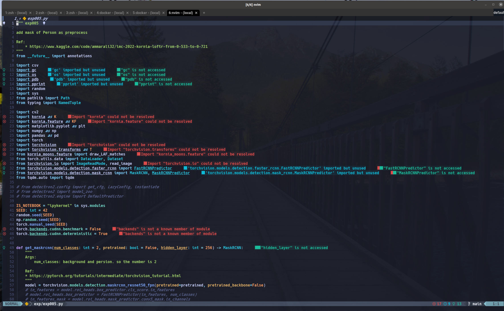
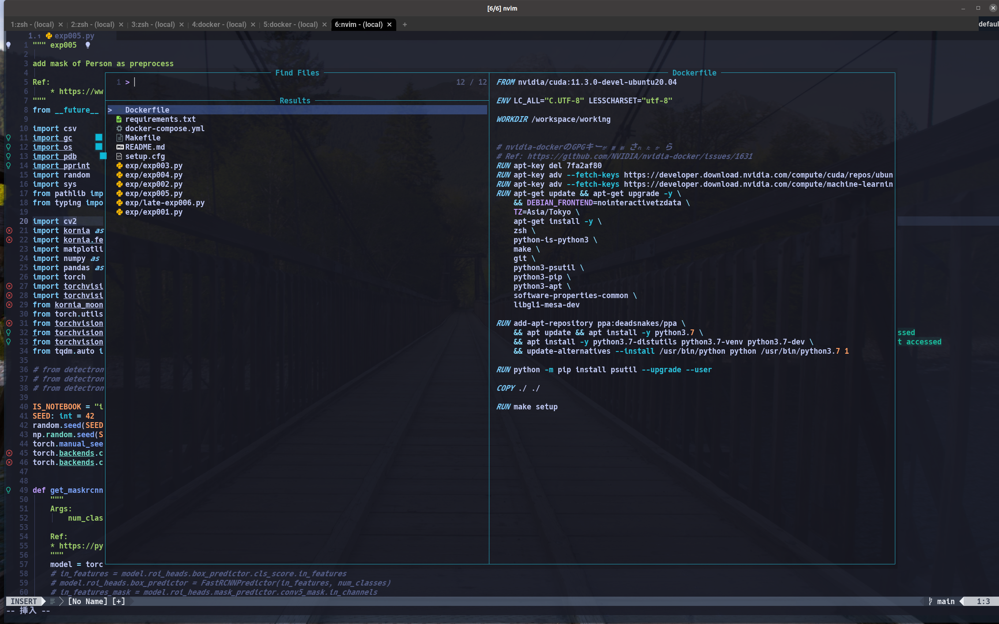

# dotfiles

this repository has codes of my dotfiles. if you want to know entire install procedure, refer to scripts/setup.sh.

But, these code might have some bugs (e.g. install-python etc.), so be careful if you use these codes.

I always develop machine learing model , datascience code , and so on by using Neovim in wezterm.

## Used

- neovim latest
  - packer.nvim
  - nvim-lsp
  - nvim-cmp
  - telescope
  - sidevar
  - luasnip
  - lualine
  - mason
  - mason-lspconfig
  - null-ls

etc.

- wezterm

## Screenshot

- screenshot on macos






## How

```sh
# procedure

# 1. clone this repository
git clone git@github.com:daikichiba9511/dotfiles.git ~/dotfiles

# 2. move
cd ~/dotfiles

# 3 run a setup script
sh scripts/setup.sh y

## if you want to install python
sh scripts/setup.sh y python

# 4 return
cd -

```

oneline commands

```
git clone git@github.com:daikichiba9511/dotfiles.git ~/dotfiles && cd ~/dotfiles && sh scripts/setup.sh y&& cd -
```

## For python user

1. Clone this repository
2. Run scripts/setup.sh
3. Open Neovim
4. Type `:PackerSync`
5. Close Neovim at once
6. Open Neovim and type `:MasonInstall pyright`
7. If you wanna use formatter with opeened buffer, type `pip install black` on your terminal.  If you install black in your develop environment, the Neovim format buffer automatically (by using null-ls).


# Reference

[1] [yutkat/dotfiles](https://github.com/yutkat/dotfiles)
