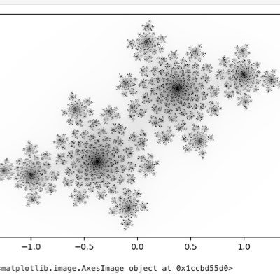

<h1 align="center">
  <br>
  dotfiles
</h1>

<p align="center">
  <strong>Personal development environment managed with <a href="https://www.chezmoi.io/">chezmoi</a></strong>
</p>

<p align="center">
  
  
  
  
  
</p>

---

## Quick Start

```sh
curl -fsLS https://raw.githubusercontent.com/daikichiba9511/dotfiles/main/install.sh | bash
```

<details>
<summary><strong>Manual Installation</strong></summary>

```sh
# Install chezmoi
sh -c "$(curl -fsLS get.chezmoi.io)" -- -b ~/.local/bin

# Clone and apply
git clone https://github.com/daikichiba9511/dotfiles.git ~/dotfiles
~/.local/bin/chezmoi init --source ~/dotfiles --apply
```

</details>

---

## Stack

### Editor

| Tool | Description |
|------|-------------|
| **Neovim** | Main editor with lazy.nvim |
| **blink.cmp** | Completion engine |
| **nvim-lspconfig + mason** | LSP management |
| **nvim-treesitter** | Syntax highlighting |
| **fzf-lua + snacks.nvim** | Fuzzy finder & utilities |

### Terminal & Shell

| Tool | Description |
|------|-------------|
| **Ghostty** | GPU-accelerated terminal (main) |
| **Herdr** | Agent-aware terminal multiplexer |
| **zsh** | Shell |
| **starship** | Cross-shell prompt |
| **mise** | Runtime version manager |

### Theme

| Tool | Theme |
|------|-------|
| **Neovim** | Rose Pine |
| **Ghostty** | Rose Pine Dawn |
| **Herdr** | Rose Pine Dawn |

---

## Keybindings

<details>
<summary><strong>Ghostty</strong></summary>

| Key | Action |
|-----|--------|
| `Cmd+Shift + k` | New tab |
| `Cmd+Shift + j` | Close tab |
| `Cmd+Shift + h/l` | Previous/Next tab |
| `Cmd+Shift + \` | Split right |
| `Cmd+Shift + -` | Split down |
| `Cmd+Shift + w` | Close split |
| `Ctrl+Shift + h/j/k/l` | Move between splits |
| `Ctrl+Alt+Shift + h/j/k/l` | Resize split |

</details>

<details>
<summary><strong>Herdr</strong> (prefix: <code>Ctrl+b</code>)</summary>

| Key | Action |
|-----|--------|
| `prefix + v` | Split right |
| `prefix + -` | Split down |
| `prefix + h/j/k/l` | Navigate panes |
| `prefix + c` | New tab |
| `prefix + n/p` | Next/Previous tab |
| `prefix + w` | Switch workspaces |
| `prefix + g` | Open session navigator |
| `prefix + q` | Detach |
| `ccs` | Open Claude Code in a right Herdr split |

</details>

---

## Structure

```
~/dotfiles/
├── .chezmoiignore          # OS-specific ignore rules
├── install.sh              # Bootstrap script
├── run_once_*.sh.tmpl      # One-time setup scripts
├── private_dot_config/     # ~/.config/*
├── private_dot_local/      # ~/.local/*
└── dot_*                   # ~/.*
```

---

## References

- [chezmoi](https://www.chezmoi.io/)
- [yutkat/dotfiles](https://github.com/yutkat/dotfiles)
- [FelixKratz/dotfiles](https://github.com/FelixKratz/dotfiles)
- [nikitabobko/AeroSpace](https://github.com/nikitabobko/AeroSpace)
