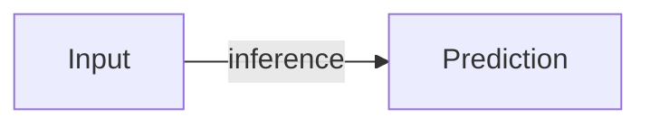

# Workspace and Markdown contracts

## Contents

1. Workspace tree
2. Coverage manifest
3. Raw solution Markdown
4. Organized solution Markdown
5. Evidence ledger
6. Synthesis files
7. Status semantics

## 1. Workspace tree

Use this stable tree:

```text
<workspace>/
├── scope/
│   ├── scope.md
│   └── coverage.csv
├── sources/
│   ├── competition.md
│   ├── leaderboard.csv
│   ├── evidence-ledger.md
│   └── discussions/
├── solutions/
│   ├── rank-001-team-slug-raw.md
│   └── rank-001-team-slug.md
├── synthesis/
│   ├── comparison-matrix.md
│   ├── common-elements.md
│   ├── differentiators.md
│   ├── task-grounded-analysis.md
│   └── strategy-retrospective.md
├── figures/
├── code/
├── reviews/
│   └── release-review.md
├── report/
│   ├── main.typ
│   ├── lib.typ
│   ├── sections/
│   └── report.pdf
└── slides/
    ├── slides.typ
    ├── theme.typ
    └── slides.pdf
```

Use zero-padded final ranks and a stable lowercase team slug. Do not rename files after citations point to them.

Store the final leaderboard as `sources/leaderboard.csv` with this exact header:

```csv
final_order,rank,team,score,medal_band
```

`final_order` is the consecutive one-based row position in the retrieved final leaderboard. It makes a complete prefix checkable while `rank` preserves Kaggle's displayed rank, including ties; do not use it to renumber tied ranks.

## 2. Coverage manifest

`scope/coverage.csv` is the authoritative completeness boundary. Use this exact header:

```csv
rank,team,team_slug,medal_band,gold_group,selected,topic_refs,raw_path,summary_path,status,method_status,evidence_limit
```

Field rules:

- `rank`: final team rank, positive integer
- `team`: final leaderboard team label
- `team_slug`: lowercase letters, digits, and hyphens
- `medal_band`: `gold` or `silver-upper`
- `gold_group`: `top`, `lower`, or empty for silver
- `selected`: `true` for every scoped row
- `topic_refs`: semicolon-separated official topic refs or `none-found`
- `raw_path`: workspace-relative paired raw path
- `summary_path`: workspace-relative paired organized path
- `status`: `pending`, `complete`, `partial`, or `unavailable`
- `method_status`: `pending`, `documented`, or `unavailable`; use `documented` when at least one team-attributable processing path can be drawn
- `evidence_limit`: short reason for partial/unavailable evidence

Example:

```csv
rank,team,team_slug,medal_band,gold_group,selected,topic_refs,raw_path,summary_path,status,method_status,evidence_limit
1,Example Team,example-team,gold,top,true,competition-slug/12345,solutions/rank-001-example-team-raw.md,solutions/rank-001-example-team.md,pending,pending,
```

## 3. Raw solution Markdown

Use this shape. Raw source content may be HTML inside the Markdown.

```markdown
---
competition: "competition-slug"
final_rank: 1
medal_band: "gold"
team: "Example Team"
topic_refs:
  - "competition-slug/12345"
retrieved_at: "2026-01-01T00:00:00Z"
retrieval_method: "Kaggle CLI 2.x via uv"
source_format: "html"
body_status: "retrieved"
comments_status: "complete"
---

# Raw solution: Rank 1 — Example Team

## Provenance

- Official URL: ...
- Authors/team mapping: ...
- Discovery queries/orderings: ...
- Pagination: ...
- Linked artifacts: ...

## Original post

<!-- Verbatim source content begins. -->
<p>...</p>
<!-- Verbatim source content ends. -->

## Comments

### Comment 123

- Author: ...
- Posted: ...
- Votes: ...
- Parent ID: ...

<!-- Verbatim source content begins. -->
<p>...</p>
<!-- Verbatim source content ends. -->

## Retrieval limitations

- None, or exact missing material.

## Search log

| time | method | query/ref | result |
|---|---|---|---|

## Search completion gate

- [ ] All selected Kaggle topic orderings and result pages were exhausted.
- [ ] The exact team name and every known member handle were searched.
- [ ] Rank/medal phrases and solution/write-up synonyms were searched.
- [ ] Linked artifacts and cross-forum candidates were checked.
```

When no public solution exists, keep the same headings. Put `Not retrieved` under Original post, retain the complete search log, and set `body_status: "unavailable"`.

## 4. Organized solution Markdown

Use this exact heading contract so validation can detect incomplete files:

```markdown
---
competition: "competition-slug"
final_rank: 1
medal_band: "gold"
team: "Example Team"
source_raw: "solutions/rank-001-example-team-raw.md"
status: "complete"
method_status: "documented"
---

# Rank 1 — Example Team

## 概要

## Solutionの全体像

Describe the input-to-submission pipeline. For every complete or partial method-bearing team, add one closed fenced Mermaid diagram that preserves the team's material branches and final convergence. The Topology record below is the semantic source of truth; Mermaid is its checkable reader-facing rendering and must use exactly the same node IDs and directed edges. A prose-only arrow string does not satisfy the contract. For an unavailable solution, state that the topology cannot be drawn from public evidence.



### Topology record

| id | kind | label | from | to | condition | source_ref | uncertainty |
|---|---|---|---|---|---|---|---|
| N1 | node | Input |  |  |  | raw topic section | none |
| N2 | node | Prediction |  |  |  | raw topic section | none |
| E1 | edge |  | N1 | N2 | inference | raw topic section | none |

Use only `kind=node` for processes or data states and `kind=edge` for relations. Every row needs a non-empty, unique ID; every node needs a label. A documented method needs at least two distinct nodes and one non-self edge. `from` and `to` must reference node IDs for edges. Use a stable local source or official reference in `source_ref`; use `uncertainty=unknown` for a publicly unresolved connection.

## Solutionのポイント

For each point, state source, setting, reported effect, and confidence.

## 理解を深めるための解説

Derive the important ideas. Define terms and symbols before using them.

## 検証・評価・再現性

Describe folds/splits, metric, public/private LB, ablations, seeds, compute, code availability, and gaps.

## 根拠と不確実性

| claim | evidence label | source | setting | confidence | limitation |
|---|---|---|---|---|---|

## 参照

- Stable official links and local raw path.
```

`Solutionの全体像` means the whole method, not a list of components. Show data flow, training, inference, postprocessing, and ensembling in their execution order.

The persisted topology record and diagram are the semantic contract for later publication. The shared Typst source under `figures/` is its rendering implementation. A report or slide may arrange it at a different scale, but must not collapse distinct member paths, input views, coordinate mappings, or ensemble routes into a generic sequence. Cross-team comparison diagrams are additional synthesis artifacts and never substitute for a per-team whole-solution diagram.

## 5. Evidence ledger

Use one row per consequential claim in `sources/evidence-ledger.md`:

```markdown
| claim_id | claim | evidence_label | source | source_owner | scope | metric_setting | used_in | confidence | limitation |
|---|---|---|---|---|---|---|---|---|---|
| C-001 | ... | participant-reported | ... | Rank 1 team | fold 0-4 | CV metric | report 4.2 | medium | no code |
```

Use `source_owner` to distinguish Kaggle/host, organizer, team, other participant, vendor, paper author, and independent reproduction.

## 6. Synthesis files

### `comparison-matrix.md`

Start with scope and coverage counts, then a wide team-by-factor matrix. Use `yes`, `no`, `unknown`, or a concrete value. Silence is `unknown`.

### `common-elements.md`

For each factor include frequency, ranks, evidence strength, mechanism, counterexamples, and uncertainty.

### `differentiators.md`

Keep top-gold vs lower-gold separate from gold vs upper-silver. Include group definition, observed difference, plausible mechanism, confounders, and conclusion strength.

### `task-grounded-analysis.md`

Use one mechanism-chain table per factor:

```markdown
| property | failure/incentive | solution element | expected effect | observed evidence | uncertainty |
|---|---|---|---|---|---|
```

### `strategy-retrospective.md`

Organize as discovery cue, falsifiable hypothesis, cheapest test, decision rule, and next investment. Include mistakes to avoid and evidence that would have changed the path.

## 7. Status semantics

- `pending`: collection or analysis has not reached a conclusion
- `complete`: main post and materially relevant comments/artifacts were retrieved and organized
- `partial`: useful solution evidence exists but a material body, artifact, pagination segment, or team mapping is missing
- `unavailable`: no public team-attributable solution was found after the documented search

`partial` and `unavailable` are valid final research outcomes. They are not permission to omit the team or fill gaps with inference.

Use only these state combinations:

| coverage `status` | `method_status` | meaning |
|---|---|---|
| `pending` | `pending` | collection or analysis is unfinished |
| `complete` | `documented` | the main evidence is complete enough to draw at least one real processing path |
| `complete` | `unavailable` | the relevant public artifacts were fully retrieved, but they expose no team-attributable processing path; complete the search gate and do not infer a pipeline |
| `partial` | `documented` | a real path is public, but a material artifact, branch, setting, or mapping is missing; show unknowns in the topology |
| `partial` | `unavailable` | contextual evidence exists, but no team-attributable processing path can be drawn; explain the limit and do not draw a guessed pipeline |
| `unavailable` | `unavailable` | no public team-attributable solution remains after the completed search gate |

A final row cannot keep `method_status=pending`. Every `partial` or `unavailable` row needs a concrete `evidence_limit`.

When revising a workspace created before `method_status`, `final_order`, `figures/gold-pipelines.typ`, and `reviews/release-review.md` existed, migrate it before validation: add the columns, classify each row from retained team-attributable evidence, move an older shared figure source such as `diagrams/gold-pipelines.typ` to the canonical `figures/gold-pipelines.typ` path, rename rank-only functions to `gold-pipeline-<rank>-<team-slug>`, update imports, and copy the current review-log template from `<skill-root>/assets/workspace-template/reviews/release-review.md`. Do not mark the unavailable-search completion boxes merely to satisfy validation; rerun and document the missing discovery steps first.
