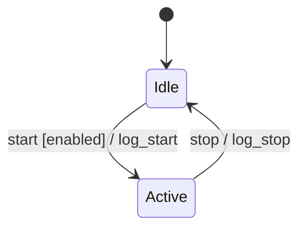
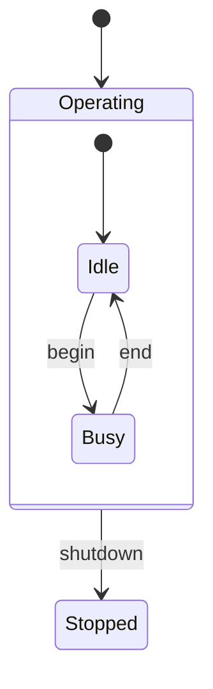
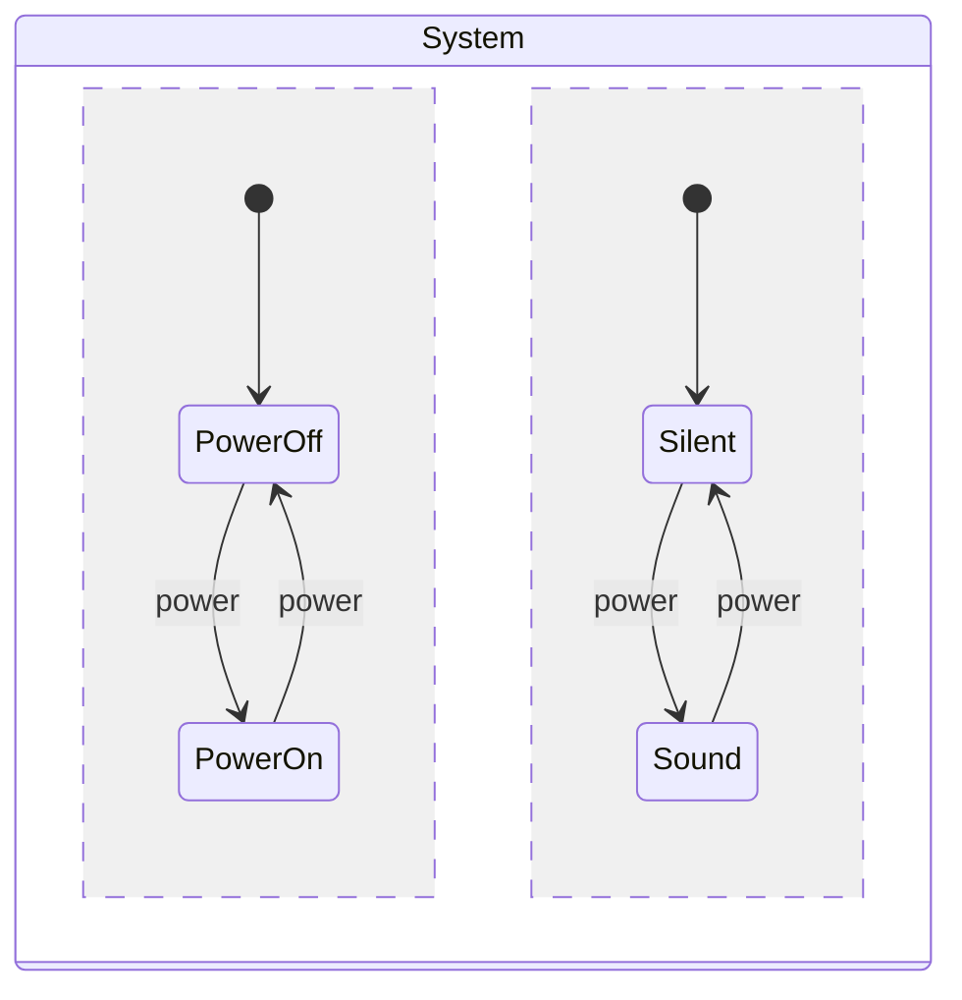

# spec-behavior

振る舞い仕様 (behavior specification) の記述・レビューを支援する。変換系は表、リアクティブ系は Mermaid 拡張状態機械で書き分け、LLM レビューで仕様の抜けを検出する。

## モード判定

最初に **write / review** のどちらかを判定する。

- `$ARGUMENTS` にファイルパスがある、または「レビュー」「チェック」「lint」を含む → **review モード**
- 「書きたい」「作りたい」「ドラフト」「雛形」を含む → **write モード**
- どちらか不明 → ユーザに確認する

---

## 共通原則

両モードで使う前提。skill 自身もこの原則に沿って判断する。

### 変換系 vs リアクティブ系

| 種類 | 判定基準 | 記述方法 |
|------|---------|---------|
| 変換系 | 出力が入力のみで決まる (履歴に依存しない) | 表 |
| リアクティブ系 | 履歴・モード・並列性に依存する | Mermaid 拡張状態機械 |

両方の側面がある場合は併記する。境界は設計メモに明示する。

### Harel 拡張のサブセット

| 機能 | Mermaid 表記 | 用途 |
|------|-------------|------|
| 階層 | `state Composite { ... }` | 共通遷移のくくり出し |
| 直交領域 | composite 内で `--` 区切り | 独立した側面の並列表現 |
| broadcast | 直交領域に**同名イベント**を書く | 並列領域への同時通知 |

### 命名 (状態・アクション・ガード)

**状態の命名**:

- 機械可読 ID は英数 + `_` を使う (例: `WaitingPayment`、`AwaitingSelection`)
- 人間向けの説明が長い・日本語の場合は `state "投入金額待ち" as WaitingPayment` で別名を付ける
- 設計メモやドキュメント本文では人間向け名を使い、Mermaid 内では ID を使う

````
state "投入金額待ち" as WaitingPayment
state "商品選択"   as Selecting
WaitingPayment --> Selecting : enough [total >= min_price]
````

**アクション・ガードの命名**:

ラベル過長 (40 文字超) や同 (src, dst) 対の多重遷移は、Mermaid auto-layout で重なって読めなくなる。**短い ID を遷移ラベルに、完全な定義を表に分離**する。状態の命名と同じ思想。

短縮前:

````
Sampling --> RetryingSampling : sampling_failed [retry_count < max_retries] / increment_retry_count
Sampling --> Failed           : sampling_failed [retry_count >= max_retries] / publish_batch_failed(current_phase)
````

短縮後:

````
Sampling --> RetryingSampling : sampling_failed [retryable] / inc_retry
Sampling --> Failed           : sampling_failed [exhausted] / fail_phase
````

横に定義表を置く:

| 動作 ID | 完全な意味 |
|--------|-----------|
| `inc_retry` | `increment_retry_count` |
| `fail_phase` | `publish_batch_failed(current_phase)` |

| ガード ID | 条件 |
|----------|------|
| `retryable` | `retry_count < max_retries` |
| `exhausted` | `retry_count >= max_retries` |

**適用の目安**: ラベル 40 文字超 or 同一 (src, dst) 対に 2 本以上の遷移。それ未満ならインラインで良い。

**副次効果**: 動作・条件を ID 化しておくと、CSP の alphabet (channel/event 集合) や TLA+ の Action 名への**移植が容易**になる。動作と意味の分離は形式化への橋渡しになる。

### UML 慣習記法

遷移ラベルは `event [guard] / action` の順で書く。

- `event`: 受信イベント名 (必須)
- `[guard]`: 発火条件 (省略可)
- `/ action`: 発火時の作用 (省略可)

例: `Idle --> Active : start [enabled] / log_start`

**記述スタイル**: ガード・アクションは**動詞ベースの自然言語**で書く (読み手の認知負荷を下げる)。

- 推奨: `start [enabled] / log_start`、`submit [email_valid] / increment_fail_count`
- 非推奨: `start [enabled = true] / fail_count' = fail_count + 1` (数式表記)

**変数参照スコープ**:

- ガード: 事前状態 (state + state variables) + イベント引数 + 定数 のみ参照可
- アクション: 事前/事後状態 + イベント引数 + 定数 を参照可
- 「ガードで未来の値を読む」「アクションで存在しない変数を使う」は不可。Mermaid は強制しないが規律として守る。

### 直積崩れ 3 パターン

全状態の直積を律儀に書くと爆発する。以下のいずれかで対処する。

| パターン | 適用場面 | やり方 |
|---------|---------|--------|
| 禁止状態 | 「この組合せはありえない」 | その状態を書かない (存在しないと宣言) |
| 遷移制限 | 「この遷移は不可」 | その遷移を書かない (発生し得ないと宣言) |
| モード依存 | モードごとに振る舞いが分岐する | モードを階層 or 直交領域に切り出す |

**最小スニペット**:

- **禁止状態** (例: 在庫切れ商品は選択肢に出ない)

  ````
  Browsing --> Selected : pick(item) [item ∈ displayedItems]
  ````

  「在庫切れ商品が選択された」状態は書かない。`displayedItems` の生成側で除外する。

- **遷移制限** (例: 釣銭不足時は高額紙幣を受け付けない)

  ````
  Idle --> Collecting : insert_bill [change_sufficient]
  Idle --> Idle      : insert_bill [!change_sufficient] / eject
  ````

  受付不可の遷移先 (`Collecting`) を書かない。

- **モード依存** (例: 同じボタンがモードで挙動分岐)

  ````
  state Operating {
      state WaitingPayment { ... }
      state Selecting { ... }
  }
  ````

  モードを階層 (または直交領域) に切り出し、同名イベントを各モード内で別の遷移として書く。直積爆発を回避できる。

### 異常系の扱い

正常系 (happy path) だけ書いて満足しない。**異常系も同じ精度で明示する**。

- 入力検証失敗 → エラー表示遷移
- 操作キャンセル → 取り消し遷移
- タイムアウト・障害 → リカバリ or エラー状態への遷移

未定義の状態×イベントは「無視」「エラー」のどちらかを設計メモで宣言する (E01 の根本対処)。

**内部遷移 (tau)**: 外部イベント不要で発火する遷移は、`internal_xxx` という命名規約で書く。Mermaid は tau を直接サポートしないため、命名で意図を示す (例: `Authenticating --> Locked : internal_check [fail_count >= 5] / lock_account`)。

### 初期化と終了

- **初期化**: `[*] --> initial_state` は必須。初期化アクションを伴うなら `[*] --> initial_state / init_action` の形で書ける。
- **終了**: 終了状態は `stateID --> [*]` で書く。ガード付きの終了判定は `stateID --> [*] : finalize_guard` の形。
- 永続稼働するシステム (サーバ・常駐プロセス等) には終了状態を書かなくて良い。

### アクションの冪等性

アクションが「複数回実行されたときに何が起きるか」を意識する。

- **累積系** (非冪等): `increment_X`、`add_to_total`、`append_log` — 名前から累積が読み取れる
- **冪等系**: `set_status_to_locked`、`mark_visible`、`reset_count` — 何度実行しても結果は同じ
- リトライ・再実行の可能性がある遷移には冪等アクションを優先。非冪等にする場合は設計メモに理由を書く。

### 高度な合成と境界 (multi-entity / refinement / 実装詳細との分離)

以下のケースのいずれかに該当する場合、[`references/multi-entity-composition.md`](./references/multi-entity-composition.md) を**先に読んで**から書く。

| ケース | 何が必要になるか |
|-------|---------------|
| 仕様の中に**2 つ以上のサブシステム**が登場 | 別図 + イベント契約表 + 通信マップ flowchart + (任意) sequenceDiagram |
| 1 つの状態の内部が大きく、**抽象 spec と詳細 spec を分けたい** | 親子 spec の refinement パターン + 相互リンク |
| 振る舞いと**実装詳細 (SNS/SQS/Lambda 等)** を切り分けたい | `xxx-spec.md` と `xxx-impl.md` の分離、配信保証等の抽象化規律 |

これらは**作業依頼 (spec) と作業詳細 (impl) の境界線**にあたる。共通原則は本ファイル、運用パターンは references を参照。

---

## write モード

### Step 1: 対象確認

ユーザに「何の振る舞いを記述したいか」を聞き、ドメインと粒度を確定する。

### Step 2: 変換系 / リアクティブ系の判定

順に聞く。

1. 「同じ入力で常に同じ出力になりますか？」
   - Yes → 変換系の候補
2. 「履歴・モード・並列性に依存しますか？」
   - Yes → リアクティブ系の候補
3. 両方ある → 両方を書く

迷う場合は具体例 (典型シナリオを 2-3 個) で問い直す。

### Step 3: 雛形生成

#### 変換系 (表)

```markdown
## 変換仕様

| 入力 | 出力 | 備考 |
|------|------|------|
|      |      |      |
```

#### リアクティブ系 (Mermaid)

**基本形**:

````markdown

````

**階層あり** (共通遷移のくくり出し):

````markdown

````

**直交領域あり** (並列性 + broadcast):

````markdown

````

`power` を両領域に同名で書くことで broadcast を表現している。

### Step 4: 設計メモを追記

ファイル末尾に必ず以下を書く。後の review・運用で必要になる前提情報。

```markdown
## 設計メモ
- 直積崩れの扱い: (禁止状態 / 遷移制限 / モード依存 のどれをどこで使ったか)
- broadcast の対応: (どのイベントが何領域に broadcast されるか)
- イベント契約 (multi-entity の場合): 共有イベントの producer/consumer/sync性 (詳細は別セクション「イベント契約表」)
- 共有状態の排他制御 (該当する場合): どの変数を誰が書き、どう競合を防ぐか
- ガードの根拠: (なぜそのガードが必要か。参照変数のスコープも)
- アクションの冪等性: (累積系/冪等系の区別、リトライ時の振る舞い)
- 未定義イベントの扱い: (無視 / エラー / 状態保持 のどれを既定にするか)
- 異常系のカバレッジ: (キャンセル / 失敗 / タイムアウト等を書き漏らしていないか)
- refinement 子 spec のリンク (該当する場合): 抽象状態 → 詳細 spec ファイルへのリンク
- 既知の未対応ケース: (意図的に省いた組合せ)
```

### Step 5: 自己チェックと出力

Write 前に以下を確認する。チェック項目を埋めずに進めない。

- [ ] 判定したシステム (変換系 / リアクティブ系 / 両方) のセクションがすべて埋まっている
- [ ] リアクティブ系なら ` ```mermaid stateDiagram-v2 ` ブロックが含まれる
- [ ] UML 慣習 `event [guard] / action` を遷移ラベルに使っている (数式 `X' = X+1` ではなく動詞 `increment_X`)
- [ ] 遷移ラベルが過長 (> 40 文字) や多重遷移で重なる懸念がない (該当時は短い ID + 定義表に分離)
- [ ] **ミドルウェア固有名詞** (SNS, SQS, Kafka, Lambda, Fargate, DynamoDB 等) が振る舞い側に混入していない (該当なら別 doc に分離)
- [ ] ガード/アクションが**変数スコープ**を守っている (ガード=事前のみ参照、アクション=事前/事後参照可)
- [ ] **異常系** (キャンセル / 失敗 / 拒否 / タイムアウト) も happy path と同じ精度で書かれている
- [ ] broadcast を使う場合は**直交領域に同名イベント**として書かれている
- [ ] (multi-entity の場合) **イベント契約表**があり、共有イベントの sync/async が明示されている
- [ ] (multi-entity の場合) **通信マップ flowchart** が含まれている (契約表の視覚化版)
- [ ] (共有状態がある場合) 排他制御方針が設計メモに書かれている
- [ ] (refinement している場合) 親 spec と子 spec が相互リンクしている
- [ ] 設計メモがファイル末尾にあり、必須 7 項目 (直積崩れ・broadcast・ガード根拠・冪等性・未定義イベント・異常系カバレッジ・未対応ケース) が書かれている。multi-entity / refinement の場合は追加項目も埋める

確認できたらユーザに保存先パスを確認してから Write する。

全体構造:

```markdown
# {対象名} 振る舞い仕様

## 変換仕様 (表)
...

## リアクティブ仕様 (Mermaid 拡張状態機械)
...

## 設計メモ
...
```

書き終えたら「続けて review モードで lint しますか？」と提案する。

---

## review モード

### Step 1: 読み込み

`$ARGUMENTS` にパスがあればそれを使う。なければ対象を確認してから Read する。

### Step 2: 機械的チェック

行番号付きで報告する。

| ID | チェック | 基準 |
|----|---------|------|
| E02 | Mermaid 構文不正 | `stateDiagram-v2` ブロックの記法エラー |
| E03 | UML 慣習違反 | `event [guard] / action` の順序ミス、`/` 抜け、`[ ]` の対応不一致 |
| I02 | 命名不統一 | 状態名・イベント名のケース/粒度ばらつき (例: `start` と `Start` の混在) |
| I03 | 初期遷移欠落 | `[*] -->` がない (どの状態から始まるか不明) |

### Step 3: 文脈チェック

LLM の判断が必要な観点。

#### error (致命的)

- **E01 未定義遷移**: 状態×イベントの組合せに対し、扱い (遷移する / 無視 / エラー) が定義されていない。「全部書き切る」か「未定義は X と扱う」を設計メモで明示しているかを確認する。
- **E04 変換系・リアクティブ系の混入**: 履歴に依存しない入出力対応が状態機械側に混入している、またはその逆。
  - **発火条件**:
    - 同じ状態に戻る遷移 (`A --> A`) が並び、ガードもアクションも**イベント引数だけで決まる** (蓄積状態を更新しない)
    - 入力 → 出力 の対応規則が単一状態で完結する Mermaid 図になっている
    - 逆向き: 履歴・モード・並列性のある振る舞いが表だけで書かれている
  - **W04 (階層化不足) との区別**: アクションが状態 (履歴・カウンタ・蓄積) を更新する場合 (例: `total += X`、`count++`) は E04 ではなく **W04** を疑う。E04 は「変換系として切り出すべき」、W04 は「階層に括れる」。
- **E05 ガードのスコープ違反**: ガードが事後状態 / 未定義の外部変数を参照しており、形式的に評価不能になっている。例: 遷移先の `next_state.count` をガードで読む、宣言されていないグローバル変数を使う。

#### warning (要検討)

- **W01 直積崩れの方針不明**: 全直積を律儀に書いている、または直積崩れの 3 パターン (禁止状態 / 遷移制限 / モード依存) のどれを採ったか設計メモに書かれていない。
- **W02 broadcast 表記不正**: 直交領域間で同名イベントを使うべきところで別名になっている、または broadcast の意図が読み取れない。
- **W03 ガード競合**: 同一状態・同一イベントで複数の遷移ガードが同時成立しうる (決定性が壊れる)。
- **W04 階層化不足**: 同パターンの遷移が複数状態で繰り返されており、階層に括れる余地がある。
- **W05 異常系カバレッジ不足**: happy path は書かれているが、対応する異常系遷移 (キャンセル / 失敗 / タイムアウト / 拒否) が欠落している、または極端に少ない。
- **W07 アクションの非冪等性が未文書化**: アクション名から副作用の累積性が読み取れず、設計メモにも冪等性の記述がない (例: `update_state` という曖昧名)。リトライ時の動作が不明。
- **W08 イベント契約の同期性未定義** (multi-entity の場合): 共有イベントが複数のエンティティ・領域に流れているのに、sync (発火元が完了を待つ) か async (発火しっぱなし) かが設計メモまたはイベント契約表に明記されていない。race condition の原因になりうる。
- **W09 共有状態の競合可能性** (multi-entity の場合): 複数の領域・別図が同じ変数を読み書きしているのに、排他制御方針 (lock / 単一書き込み元 / CAS 等) が設計メモにない。
- **W10 実装詳細の混入**: 振る舞い側にミドルウェア固有名詞 (SNS / SQS / Kafka / Lambda / Fargate / DynamoDB 等) や関数名・queue 名・topic ARN が書かれている。配信保証・通信形態・永続性などの**抽象的性質**に置き換え、ミドルウェア選定は別 doc (`xxx-impl.md`) に隔離する余地。

#### info (改善余地)

- **I01 アクションなし遷移にコメントなし**: 副作用のない遷移が並んでおり、意図的なのか単なる漏れかが分からない。
- **I04 表記スタイル**: ガード/アクションが数式記法 (`X' = X + 1`、`Y = Y * 2`) で書かれており、動詞ベースの自然言語 (`increment_X`、`double_Y`) の方が読みやすい。
- **I05 通信マップなし** (multi-entity の場合): エンティティが 2 つ以上ある仕様で、エンティティ間の関係を俯瞰する **flowchart (通信マップ)** が含まれていない。契約表だけでは読み手が全体像を組み立てる負担が大きい。sequenceDiagram があれば併せて確認する。
- **I06 ラベル過長**: 遷移ラベルが 40 文字超、または同一 (src, dst) 対に 2 本以上の遷移があり、Mermaid auto-layout でラベル重なりが起こりうる。**アクション・ガードを短い ID に置換し、定義表に分離**する余地 (CSP/TLA+ への移植も容易になる)。

### Step 4: 報告

prose-lint スタイル。severity 別に並べ、各指摘に **行番号・現状の引用・修正提案** を添える。

**行番号は元ファイルの先頭からカウントする** (Mermaid ブロック内の相対位置ではない)。引用する箇所の正確な行番号を確認してから書く。

```markdown
## レビュー結果サマリー
- error: N件 / warning: N件 / info: N件

## 詳細

### error

**E01** L12: 未定義遷移
> 状態 `Idle` でイベント `cancel` の扱いが定義されていません。
> 提案: 「無視 (self-loop)」または「エラー」を明示するか、設計メモに「未定義イベントは無視」と書く。

**E04** L25-30: 変換系の表が状態機械に混入
> `Active --> Active : recompute` で出力値のみが変わる遷移が 5 行並んでいます。
> 提案: この遷移群を取り除き、「変換仕様」セクションに表として切り出す。

### warning

**W01** L40: 直積崩れの方針不明
> 全状態×全イベントを書こうとして爆発している、または既に省いた組合せの根拠が見えません。
> 提案: 設計メモに「禁止状態 / 遷移制限 / モード依存」のどれを採ったかを書く。

### info

**I01** L8: アクションなし遷移にコメントなし
> ...
```

---

## ルール

- 指摘には必ず**具体的な修正提案**を添える。
- review モードでは**提案のみ**。ファイルを直接編集しない。
- write モードは**保存先をユーザに確認**してから書く。
- 「変換系か/リアクティブ系か」迷ったら**両方併記**し、境界を設計メモに残す。
- 直積崩れは **3 パターンを使い分ける**。全直積を律儀に書かない。
- broadcast は **同名イベント**で表現する。
- 完全性は「全イベント×全状態を書き切る」ではなく「**未定義は X と扱う** を設計メモに明記」でも可とする。

$ARGUMENTS
