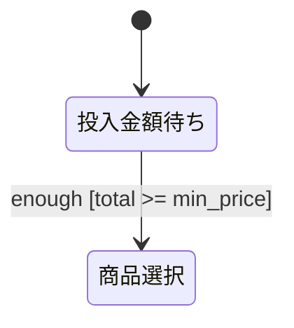
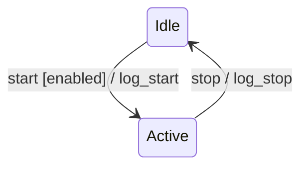
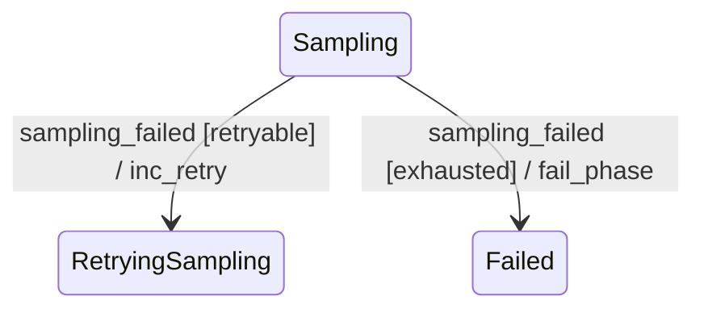
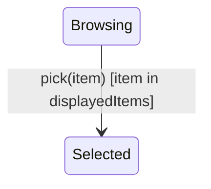
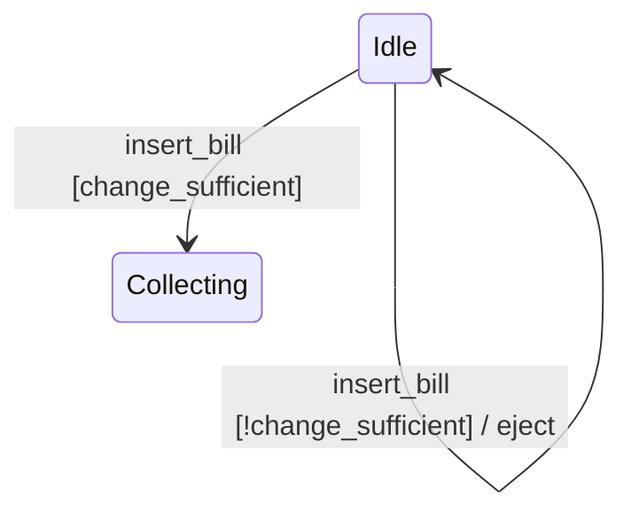
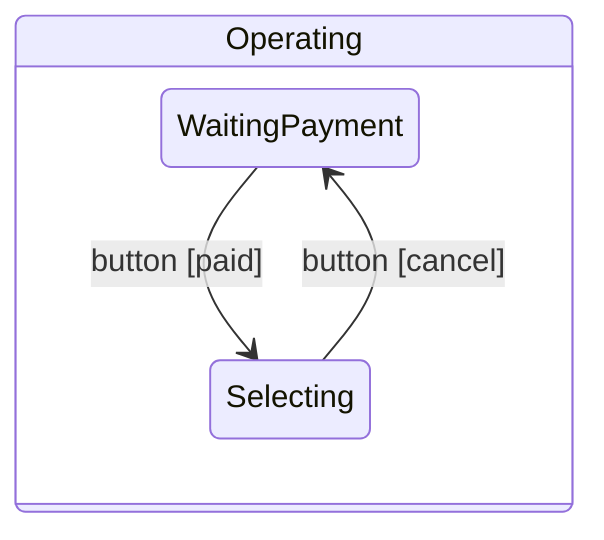
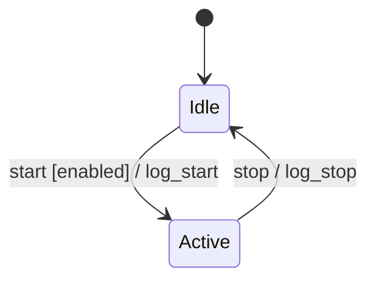
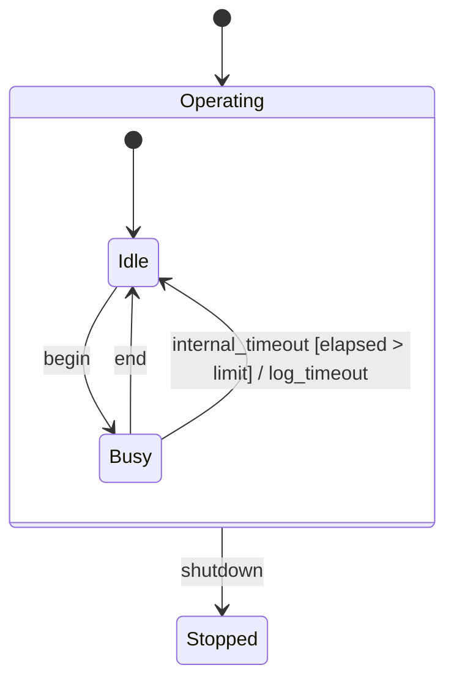
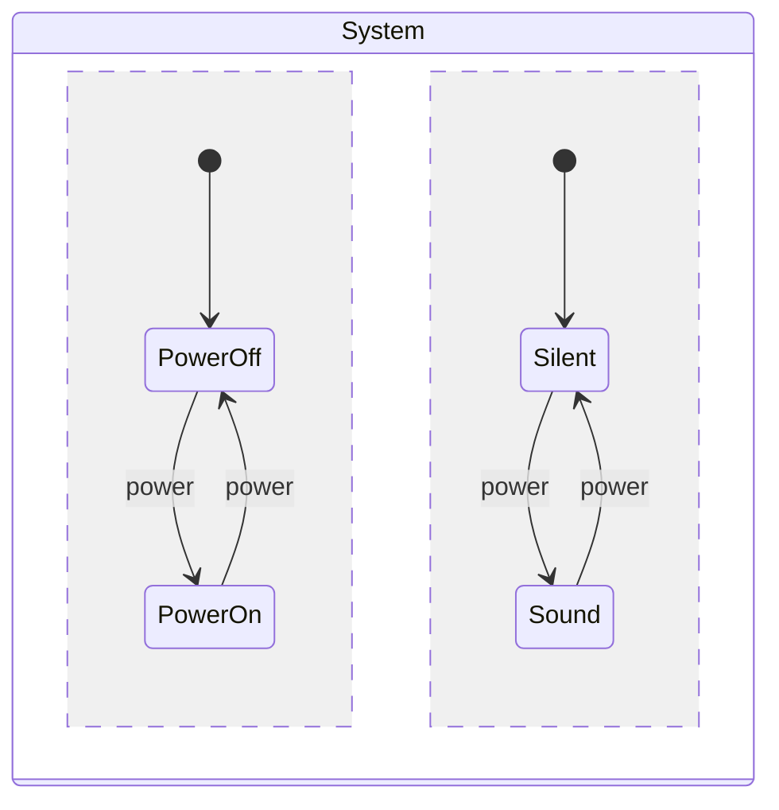

# Behavior Spec Guide

振る舞い仕様を書く・レビューするための詳細規約。

## Conversion vs Reactive

| 種類 | 判定基準 | 記述方法 |
|------|----------|----------|
| 変換系 | 出力が入力のみで決まり、履歴に依存しない | 表 |
| リアクティブ系 | 履歴・モード・状態・並列性に依存する | Mermaid `stateDiagram-v2` |

両方の側面がある場合は両方を書く。境界は設計メモに明示する。

## Mermaid State Machine Subset

Use this Harel-style subset:

| 機能 | Mermaid 表記 | 用途 |
|------|--------------|------|
| 階層 | `state Composite { ... }` | 共通遷移のくくり出し |
| 直交領域 | composite 内で `--` 区切り | 独立した側面の並列表現 |
| broadcast | 直交領域に同名イベントを書く | 並列領域への同時通知 |

### State Naming

- Machine-readable state IDs use ASCII letters, digits, and `_`.
- For long or Japanese labels, use an alias: `state "投入金額待ち" as WaitingPayment`.
- Use human-readable names in prose, and IDs inside Mermaid.



### Transition Labels

Use the UML convention:

```text
event [guard] / action
```

- `event`: received event name. Required.
- `[guard]`: firing condition. Optional.
- `/ action`: effect when fired. Optional.
- For payloads and arguments, use function form: `pick(item)`, `publish_failed(current_phase)`.

Examples:



### Guard and Action Style

Use short verb-based IDs for guards and actions.

- Good: `submit [email_valid] / increment_fail_count`
- Avoid: `submit [email.valid == true] / fail_count' = fail_count + 1`

Scope rules:

- Guards may reference only prior state, state variables, event arguments, and constants.
- Actions may reference prior/post state, event arguments, and constants.
- A guard must not read a future value or an undeclared variable.

If a label exceeds about 40 characters, or if multiple transitions share the same `(src, dst)` pair, put short IDs in Mermaid and add definition tables.



| Action ID | Meaning |
|-----------|---------|
| `inc_retry` | increment retry count |
| `fail_phase` | publish batch failure for the current phase |

| Guard ID | Condition |
|----------|-----------|
| `retryable` | `retry_count < max_retries` |
| `exhausted` | `retry_count >= max_retries` |

## Product-Breakdown Patterns

Avoid writing the full Cartesian product of all states. Use one of these patterns.

| Pattern | When | How |
|---------|------|-----|
| Forbidden state | A combination cannot exist | Do not write that state, and state why |
| Transition restriction | A transition is impossible or rejected | Do not write the impossible target; write the rejection/no-op if needed |
| Mode dependence | Same event behaves differently by mode | Split modes into hierarchy or orthogonal regions |

Forbidden state example:



Transition restriction example:



Mode dependence example:



Same-name events in hierarchy express mode-dependent exclusive choice. Same-name events in orthogonal regions express broadcast.

## Abnormal Paths

Do not stop at the happy path. Include abnormal behavior at the same level of precision:

- validation failure
- rejection
- cancel
- timeout
- failure
- retry or recovery

For undefined state-event pairs, state the default behavior in design notes:

- ignored as self-loop/no-op
- treated as error
- impossible by invariant

Internal transitions that do not require an external event should use an `internal_` prefix, such as `internal_check`.

## Initialization and Completion

- Include `[*] --> initial_state`.
- Initialization actions may be written as `[*] --> initial_state / init_action`.
- Ending transitions use `State --> [*]`.
- Long-running systems do not need a final state.

## Action Idempotency

Make retry behavior clear.

| Type | Examples | Note |
|------|----------|------|
| Accumulative | `increment_X`, `add_to_total`, `append_log` | Non-idempotent; retry behavior must be clear |
| Idempotent | `set_status_to_locked`, `mark_visible`, `reset_count` | Preferred for retryable transitions |

If a non-idempotent action can run more than once, explain why that is acceptable in design notes.

## Write Templates

### Conversion Spec

```markdown
## 変換仕様

| 入力 | 出力 | 備考 |
|------|------|------|
|      |      |      |
```

### Reactive Spec

````markdown
## リアクティブ仕様


````

### Hierarchy

````markdown

````

### Orthogonal Regions and Broadcast

````markdown

````

The same `power` event appears in both orthogonal regions, so it is broadcast.

## Design Notes Template

Append this section to generated specs.

```markdown
## 設計メモ

**必須**:
- 直積崩れの扱い: 禁止状態 / 遷移制限 / モード依存 のどれをどこで使ったか
- broadcast の対応: どのイベントがどの領域に broadcast されるか。該当なしなら「なし」
- ガードの根拠: なぜそのガードが必要か。参照変数のスコープも含める
- アクションの冪等性: 累積系 / 冪等系の区別、リトライ時の振る舞い
- 未定義イベントの扱い: 無視 / エラー / 不可能 のどれか
- 異常系のカバレッジ: cancel / fail / reject / timeout などの扱い
- 既知の未対応ケース: 意図的に省いた組合せ

**該当時**:
- イベント契約: 共有イベントの producer / consumer / sync 性
- 共有状態の排他制御: 誰がどの変数を書き、どう競合を防ぐか
- refinement 子 spec のリンク: 抽象状態から詳細 spec へのリンク
- 実装詳細 doc のリンク: `xxx-spec.md` と `xxx-impl.md` の相互リンク
```

## Write Self-Check

Before writing a generated spec, verify:

- The spec includes every required section for conversion, reactive, or mixed behavior.
- Reactive specs include a Mermaid `stateDiagram-v2` block.
- Transition labels follow `event [guard] / action`.
- Long labels are shortened with ID definition tables when needed.
- Middleware names are not mixed into behavior specs unless explicitly part of the domain.
- Guard and action variable scopes are valid.
- Abnormal paths are covered at the same level as happy paths.
- Broadcast uses same-name events in orthogonal regions.
- Multi-entity specs include an event contract table and communication map.
- Shared state has an exclusion or ownership policy.
- Refinement specs link parent and child specs both ways.
- Behavior and implementation docs link each other if separated.
- Design notes include all required items.

## Review Checklist

### Mechanical Checks

| ID | Severity | Check |
|----|----------|-------|
| E02 | error | Mermaid syntax or `stateDiagram-v2` block is malformed |
| E03 | error | Transition label violates `event [guard] / action` order or bracket/slash conventions |
| I02 | info | State/event naming is inconsistent |
| I03 | info | Initial transition `[*] -->` is missing |

### Semantic Checks

| ID | Severity | Check |
|----|----------|-------|
| E01 | error | Undefined state-event combinations are neither specified nor covered by a default rule |
| E04 | error | Conversion behavior is modeled as state transitions, or reactive behavior is flattened into a table |
| E05 | error | Guards read future state or undeclared variables |
| W01 | warning | Product-breakdown policy is unclear |
| W02 | warning | Broadcast is incorrectly expressed or uses different event names |
| W03 | warning | Guards on the same state/event can overlap, breaking determinism |
| W04 | warning | Repeated transition patterns should be factored into hierarchy |
| W05 | warning | Abnormal paths are missing or much thinner than happy paths |
| W06 | warning | Non-idempotent action behavior is undocumented |
| W07 | warning | Multi-entity event sync/async contract is missing |
| W08 | warning | Shared state can race and has no exclusion/ownership policy |
| W09 | warning | Middleware or infrastructure detail is mixed into behavior spec |
| I01 | info | Transition has no action and no note explaining that this is intentional |
| I04 | info | Guards/actions use dense formula notation instead of readable verb IDs |
| I05 | info | Multi-entity spec lacks a communication map |
| I06 | info | Mermaid labels are long or likely to overlap |

### E04 vs W04

Do not confuse these:

- E04: state machine is being used for stateless input-output conversion, or a stateful behavior is represented only as a table.
- W04: reactive behavior is valid, but repeated transition patterns suggest hierarchy would make it clearer.

## Review Report Format

Use line numbers from the original file, not relative line numbers inside Mermaid blocks.

```markdown
## レビュー結果サマリー
- error: N件 / warning: N件 / info: N件

## 詳細

### error

**E01** L12: 未定義遷移
> 現状: 状態 `Idle` でイベント `cancel` の扱いが定義されていません。
> 提案: 遷移を追加するか、設計メモに「未定義イベントは無視」と明記する。

### warning

**W01** L40: 直積崩れの方針不明
> 現状: 省略した状態組合せの根拠が見えません。
> 提案: 設計メモに「禁止状態 / 遷移制限 / モード依存」のどれを採ったかを書く。

### info

**I01** L8: アクションなし遷移に説明なし
> 現状: ...
> 提案: ...
```

