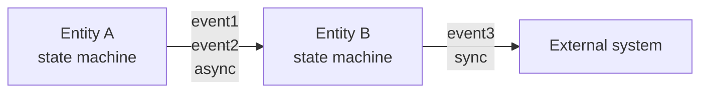
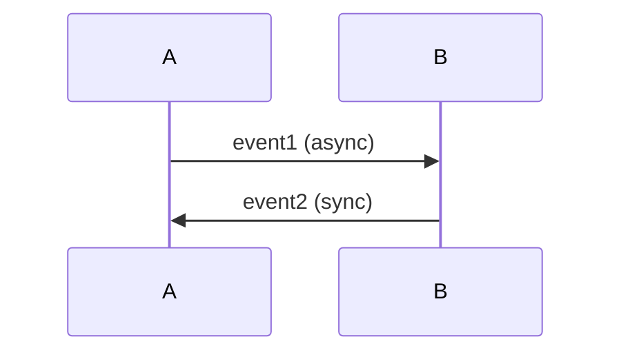

# Multi-Entity Composition, Refinement, and Implementation Separation

Use this reference when a behavior spec includes multiple subsystems, a large abstract state that needs refinement, or implementation details that should be separated from behavior.

## When To Use

| Case | Need |
|------|------|
| Two or more subsystems appear in the spec | Separate diagrams, event contracts, communication map, and optional sequence diagram |
| One state is too large and needs an abstract/detail split | Parent-child spec refinement with links |
| Middleware names appear in the behavior spec | Separate `xxx-spec.md` and `xxx-impl.md` |

## Multi-Entity Specs

For practical specs, prefer separate diagrams plus an event contract table.

| Approach | When | Strength | Weakness |
|----------|------|----------|----------|
| Separate diagrams + event contract table | Subsystem event collaboration | Readable and practical | Synchronization semantics must be written explicitly |
| Add sequence diagram | Protocol negotiation or typical scenario | Shows order | Does not replace internal state diagrams |
| Single diagram | Strongly coupled subsystems | One view | Often becomes unreadable |

### Event Contract Table

```markdown
| Event | Producer | Consumer | Sync | Payload | Notes |
|-------|----------|----------|------|---------|-------|
| `event_a` | Subsystem A | Subsystem B | async / at-least-once / broadcast | `{key: type}` | |
| `event_b` | Operator | Subsystem A | manual trigger | `{id: str}` | |
```

Rules:

- Shared events use the same name in all diagrams.
- Always state sync behavior:
  - `sync`: producer waits for completion.
  - `async`: producer emits and continues.
  - `at-most-once`, `at-least-once`, `exactly-once` when delivery guarantees matter.
  - `broadcast`, `point-to-point`, or `pub-sub` when communication shape matters.
- Payloads include type and shape.
- Shared state must be listed separately with an ownership or exclusion policy.

### Communication Map

Multi-entity specs should include a flowchart communication map. It visualizes the event contract table.



Roles:

- `flowchart`: static overview of who talks to whom.
- `sequenceDiagram`: typical order for one scenario.
- `stateDiagram`: internal behavior of each entity.
- event contract table: formal constraints for sync behavior and payloads.

### Optional Sequence Diagram

Use this for a representative happy path or protocol flow.



Do not force all abnormal cases into one sequence diagram. Use separate diagrams or notes when needed.

## Refinement

Use refinement when one state is too large for one diagram.

- Parent spec: keep the abstract state and omit the internal details.
- Child spec: explain the internal behavior of that abstract state.
- Parent design notes link to the child spec.
- Child header states which parent state it refines.

Decision rule:

| Use | When |
|-----|------|
| Hierarchy inside one diagram | Internal behavior is small, roughly five states or fewer |
| Separate child spec | Internal behavior is large, or readers differ between architecture and implementation levels |

Example parent note:

```markdown
`ParallelSetup` の詳細は [parallel-setup-spec.md](./parallel-setup-spec.md) を参照。
```

Example child header:

```markdown
# ParallelSetup 詳細仕様

この spec は親仕様 `system-spec.md` の `ParallelSetup` 状態を展開する。
```

## Separate Behavior From Implementation

Behavior specs describe the requested behavior. Implementation docs describe how it is built.

| Include in behavior spec | Move to implementation doc |
|--------------------------|----------------------------|
| sync / async | SNS / SQS / Kafka |
| delivery guarantee | Lambda / Fargate / ECS |
| ordering guarantee | IAM, queue names, topic ARNs |
| communication shape | language, library, framework |
| persistence semantics | deployment, scaling, cost |
| state transitions and event rules | DLQ settings and concrete retry mechanics |

Rewrite examples:

| Avoid | Prefer |
|-------|--------|
| `async (SNS pub)` | `async / at-least-once / broadcast` |
| `publish_to_prelabel_topic` | `emit_prelabel_completed_event` |
| `start_sampling_lambda` | `enter_sampling` |
| `Lambda: sampling in VPC` | `Sampling` |
| `SQS DLQ retry count` | `retry count for retry queue, decided by implementation layer` |

Recommended placement:

- Behavior: `xxx-spec.md`
- Implementation: `xxx-impl.md`
- Design notes include mutual links.

